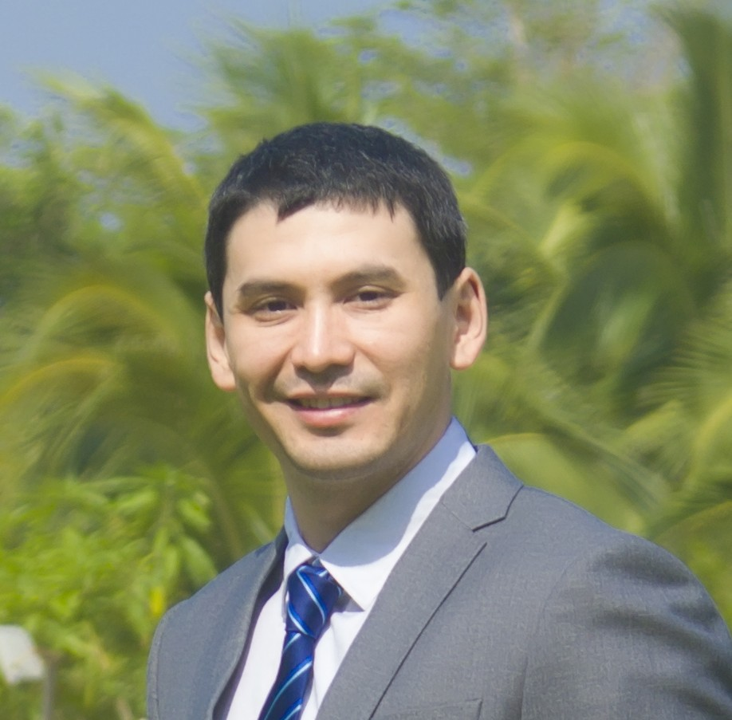

```{r setup, include=FALSE}
knitr::opts_chunk$set(
  include = TRUE
  , echo = FALSE
  , warning = FALSE
  , message = FALSE)
```

```{r libraries}
if (!require(knitr)) {install.packages("knitr")}
if (!require(kableExtra)) {install.packages("kableExtra")}
if (!require(tidyverse)) {install.packages("tidyverse")}
```

# About Kushnazarov

## Basic Information

<table class="custom_table", style="border: 0px solid transparent;">
  <tr>
   <td style="vertical-align: middle">  Name
                                        <br>
                                        <br>
                                        <br>Contacts
   </td><td style="vertical-align: middle "> Kushnazarov Farruh 
                                        <br> 法如赫 
                                        <br>
                                        <br> 173-2116-0407 
                                        <br> k.farruh@bk.ru 
   </td><td style="text-align:center" colspan="2">  
   </td>
  </tr><tr>
   <td> Major 
   </td><td colspan="3"> Mathematical modeling, numerical calculation and coordination of computer programs 
   </td>
  </tr><tr>
   <td> Highest Education 
   </td><td colspan="3"> Ph.D. from St.Petersburg National Alexander I Emperor Transportation University 
   </td>
  </tr><tr>
   <td> Languages
   </td><td> English
   </td><td> Russian
   </td><td> Chinese
  </tr><tr>
   <td> 
   </td><td> Excellent
   </td><td> Native speaker
   </td><td> HSK2 (elementary) 
   </td>
  </tr>
</table>

## Bachelor and Master

Kushnazarov Farruh’s favorite subject from freshman year was mathematics and communication network system. Because of this, his final thesises for bachelor and master degree were about the communication network system. After successfully achieved master degree with a high score, he got an offer from the university to continue researching on communication network. Feeling the needs for practical experiences, he started to work as an assistant professor and programmer for two years, during which he collected remarkable experiences and data for further researches. 

## PhD
Finally in 2012 he back to university to apply Ph.D. and work with a well-acknowledged professor in communication network and virtualization fields. As a researcher he not only considered in theoretical part but worked with several companies for applications as well. Moreover each result was provided for implementations on data-centers, smart-city and other projects. In Russia, especially Saint-Petersburg researcher Kushnazarov Farruh’s papers were frequently cited and discussed in dozens of conferences by other researchers. Kushnazarov Farruh has given 144 hours lectures on communication network system for students and published two textbooks as the first author.

## Nowadays
- In 2016 he moved to Shanghai for working as a data scientist in a well-known online education company. He is working on different machine learning and deep learning projects. His dozens of projects brought large benefits to the company. 
- Even with heavy-loaded work, every year, he publishes scientific articles on artificial intelligence and communication network fields in international conference, including the international academic platforms such as IEEE, ACM and others.


# Goal and Mission of DLL Protocols

## Research Goal
Based on the variation of the basic parameters of the protocols and transmission procedures to develop and evaluate the performance of communication protocols that provide guaranteed data delivered over communication channels with noise. 

## Research Missions
- Analyze the methods of FEC (Forward Error Correction) for detecting errors and recovering information in communication channels with noise, taking into account the determination of the main factors.
- Define the impact of noise on network performance on the different ARQ (Automatic Repeat Request) modes.
- Develop a mathematical model of the proposed method for evaluating performance, taking into account the peculiarities of computational algorithms for implementation of FEC for different ARQ modes to increase Shannon capacity.
- Develop recommendations for data link layer protocol’s settings to achieve a given level of performance.

# Scientific Novelty

## The following results are obtained during the research DLL (Data Link Layer) Protocols, which are brand new:

- A method is proposed for evaluating the performance of DLL protocols operating in information and telecommunication networks with noise. This method differs from the known methods by taking into account the level of noise in data transmission channels, as well as the specifics of the organization of data transmission modes.
- A complex of programs has been created on C/C++ and Matlab, which confirmed the theoretical results. It is suitable for evaluating the performance parameters of data link protocols.

# Encoder and Decoder

## Implemented Convolutional Encoder and Decoder
To experimentally determine the operability of the Viterbi decoder with offered method using the Matlab environment (Simulink, Communication Toolbox package), a communication channel model was built. The parameters of the Viterbi decoder are taken as follows: R = 1/2, d = 7, L = 19. The input data stream in the form of a sequence of pseudorandom numbers, the frame size is 1120 bytes.

<p align="center">
  <figure>
    <a target="_blank" href="input/img/research/viterbi.png">
      
    </a>
    <figcaption>Fig.1 - Simulation Viterbi Decoder on Mathlab: Communication Toolbox</figcaption>
  </figure>
</p> 


# Result of the Research

## A methodology has been developed for calculating the real data transfer rate for the ARQ methods Stop-and-Wait, Go-Back-N, Selective Repeat based on the frame sizes, the number of frames in the window and the level of noise in the communication channels. Recommendations are given on setting up a timer for various data transfer methods.  

## A simulation computer modeling of data transfer processes using CRC codes in two environments (C/C ++ and Matlab) was carried out under conditions of varying values of the noise level in the data transmission channel. The necessity of choosing the type of standardized generating polynomial, which can reduce the probability of failure to detect errors in frames, is substantiated.

## Simulated data transfer process using convolutional coder/decoder to determine the probability of the incorrect decoding of received data is carried out. The expediency of using the technique of interleaving symbols to reduce the level of this parameter is proven. 

## The results of simulations and implement models on the EMC2 data-center and SmartCity projects of Moscow are compared. It is shown that their deviation does not exceed the boundaries of 11%, which confirms the consistency of the research.

# Implementation of Research Results and Major Publications

## Implementation of Research Results
- Implemented at the company L-Cube LLC in order to optimize the performance of the departmental network;

- Implemented at the company Domus Sapiens LLC  to improve the quality of data transfer in wireless network;

- The tested result on the EMC2 data-center.

<p align="center">
  <figure>
    <a target="_blank" href="input/img/research/l_cube.jpg">
      
    </a>
    <a target="_blank" href="input/img/research/domus_sapiens.jpg">
      
    </a>
    <a target="_blank" href="input/img/research/emc_dell.png">
      
    </a>
    <figcaption>Fig.2 - Implementation Certificates</figcaption>
  </figure>
</p> 


## Major Publications: During 2013 – 2020:
- published 13 articles;
  - Google Scholar Page: https://scholar.google.com/citations?hl=en&user=4n37sesAAAAJ
- two textbooks;
- a book on customer lifecycle; and
- obtained two patents.

<p align="center">
  <figure align="center">
    <a target="_blank" href="input/img/research/IT_patents/osi_protocol.jpg"> 
      
    </a>
    <a target="_blank" href="input/img/research/IT_patents/dust.jpg"> 
      
    </a>
    <figcaption>Fig.3 - Patents</figcaption>
  </figure>
</p>

# Invitations for Further Researches

## 
<p align="center">
  <figure align="center">
    <a target="_blank" href="input/img/research/recomendations/recomendations_1.jpg"> 
      
    </a>
    <a target="_blank" href="input/img/research/recomendations/recomendations_2.jpg"> 
      
    </a>
    <a target="_blank" href="input/img/research/recomendations/recomendations_3.jpg"> 
      
    </a>
    <a target="_blank" href="input/img/research/recomendations/recomendations_4.jpg"> 
      
    </a>
    <figcaption>Fig.4 - Recomendation Letters</figcaption>
  </figure>
</p>

# Future Plan

## The main expected results of the research can be summarized as follows:

1. Analysis of existing methods for increasing the throughput protocols showed their
limitations in taking into account the presence of the noise in the communication
channel and not implemented AI to reach the required throughput.
2. To define significant factors, which impact the throughput of the cellular network.
3. The method decreases the latency by incorporating AI to HARQ for different modes,
based on the historical data.